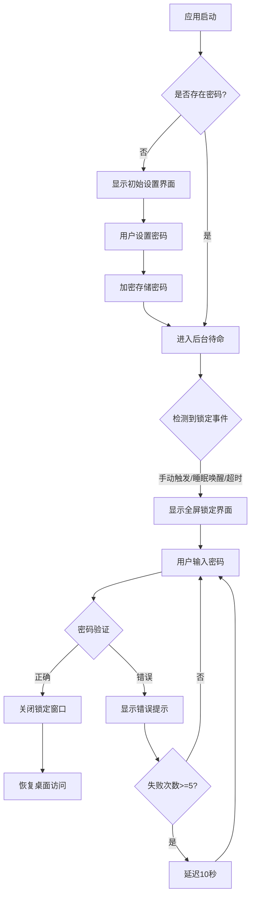

# 电脑屏幕锁定器 - 产品需求文档 (PRD)

## 1. 产品概述

一款桌面端屏幕锁定应用程序，当电脑从睡眠状态唤醒或手动触发时，自动显示全屏密码验证界面，防止未授权访问。目标用户是注重个人隐私和电脑安全的办公人员及学生，提供简单高效的电脑安全保护方案。

## 2. 核心功能

### 2.1 用户角色

| 角色 | 权限说明 |
|------|----------|
| 管理员（机主） | 设置/修改密码、配置锁定参数、解锁使用电脑 |
| 未授权用户 | 仅可查看锁定界面，无法操作电脑 |

### 2.2 功能模块

1. **锁定界面模块**：全屏覆盖、密码输入框、时间显示、状态提示
2. **密码管理模块**：初始设置、修改密码、密码强度验证
3. **系统控制模块**：系统托盘图标、快捷键绑定、自动锁定计时
4. **安全防护模块**：禁用任务管理器、阻止 Alt+Tab 切换、防强制关闭

### 2.3 页面功能详情

| 页面名称 | 模块名称 | 功能描述 |
|----------|----------|----------|
| 锁定屏幕 | 密码输入区 | 全屏显示、居中布局、密码输入框（支持回车确认）、错误提示动画 |
| 锁定屏幕 | 时间信息区 | 实时显示当前时间（时:分:秒）、日期（年月日 星期） |
| 锁定屏幕 | 状态提示区 | 密码错误次数提示、锁定状态指示、欢迎语 |
| 设置面板 | 密码设置区 | 新密码输入、确认密码、密码强度指示器、修改成功提示 |
| 设置面板 | 行为配置区 | 自动锁定超时设置（1-60分钟）、开机自启动选项、快捷键自定义 |
| 系统托盘 | 托盘菜单 | 快速锁定、打开设置、退出程序（需密码验证） |

## 3. 核心流程

### 3.1 主流程描述

**正常锁定-解锁流程：**
1. 用户触发锁定（手动点击/系统睡眠唤醒/超时自动锁定）
2. 应用程序检测到锁定事件，立即显示全屏锁定窗口
3. 锁定窗口覆盖整个屏幕，置顶显示，捕获所有键盘鼠标事件
4. 用户在密码输入框输入密码并按回车或点击确认按钮
5. 系统验证密码正确性：
   - 正确 → 关闭锁定窗口，恢复正常桌面访问
   - 错误 → 显示错误提示（抖动动画），记录失败次数，连续失败5次后延迟10秒响应
6. 解锁成功后返回正常使用状态

**首次使用流程：**
1. 应用程序首次启动，检测到无已存储密码
2. 弹出初始密码设置对话框
3. 用户输入新密码并确认
4. 密码加密存储到本地配置文件
5. 进入正常待命状态（后台运行）

## 4. 用户界面设计

### 4.1 设计风格

- **设计理念**：现代极简安全风格，深色主题为主，传达专业与安全感
- **主色调**：深空蓝渐变背景 (#0a0e27 → #1a1f3a)，配合青蓝色强调色 (#00d4ff)
- **辅助色**：成功绿 (#00ff88)、错误红 (#ff4757)、文字白 (#ffffff / rgba(255,255,255,0.87))
- **按钮样式**：圆角胶囊状 (border-radius: 25px)，微妙的玻璃态效果 (backdrop-filter: blur)
- **字体选择**：
  - 标题/时间：Orbitron（科技感显示字体）
  - 正文/UI：Noto Sans SC（中文优化无衬线字体）
- **布局风格**：绝对居中对称布局，大量留白营造专注感
- **动效要求**：
  - 背景缓慢流动的粒子/光点效果
  - 密码错误时的左右抖动反馈动画
  - 输入框聚焦时的发光边框效果
  - 界面出现时的淡入+轻微上移组合动画
  - 时间数字变化时的翻转/滑动过渡效果

### 4.2 页面设计详情

| 页面名称 | 模块名称 | UI 元素说明 |
|----------|----------|-------------|
| 锁定屏幕 | 背景层 | 深蓝渐变底色 + 动态粒子系统（缓慢漂浮的光点） + 微妙网格纹理叠加 |
| 锁定屏幕 | 时间显示 | 超大字号（72px+）当前时间，Orbitron 字体，青蓝色渐变文字，下方小字显示完整日期和星期 |
| 锁定屏幕 | 密码输入区 | 居中卡片容器（毛玻璃效果），圆角输入框（密码遮罩显示），右侧确认按钮，placeholder 提示"请输入密码" |
| 锁定屏幕 | 状态提示 | 输入框下方的小字提示区域，默认显示"电脑已锁定"，错误时显示红色"密码错误，请重试" |
| 设置面板 | 整体容器 | 半透明深色模态框，居中显示，带阴影和模糊背景，标题栏"锁定器设置" |
| 设置面板 | 密码修改区 | 当前密码输入（可选）、新密码输入、确认密码输入，每个字段带强度指示条 |
| 设置面板 | 配置选项区 | 自动锁定时间下拉选择（1/5/10/15/30/60分钟/永不）、开机自启开关、快捷键显示 |

### 4.3 响应式适配

- **主要平台**：Windows 桌面端（优先适配）
- **屏幕适配**：支持不同分辨率（1366x768 至 4K），所有元素使用相对单位/vw-vh 确保居中和比例协调
- **DPI 感知**：支持 Windows 高 DPI 缩放（125%/150%/200%）
- **多显示器**：锁定所有显示器（扩展模式下跨屏显示）

### 4.4 特殊交互细节

- **密码输入**：每个字符输入时有短暂的星号闪烁动画，0.5秒后变为固定圆点
- **Caps Lock 提示**：检测到大写锁定开启时，输入框上方显示橙色警告提示
- **虚拟键盘支持**：可选启用屏幕虚拟键盘（触摸设备友好）
- **解锁音效**：成功时播放轻柔提示音（可关闭），失败时播放低沉错误音
