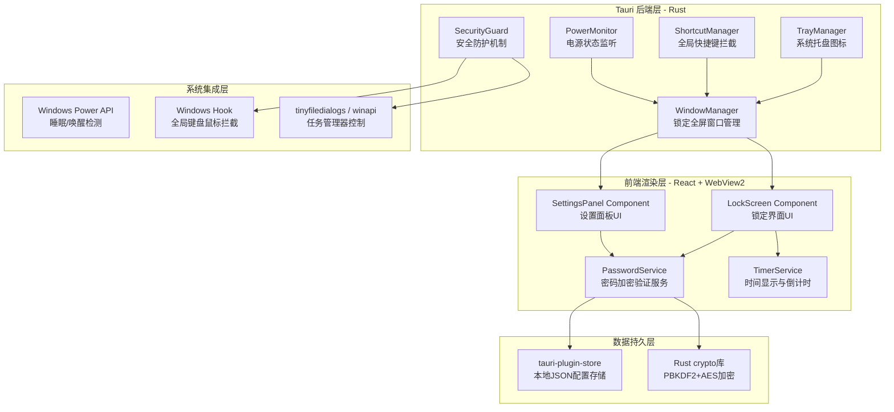
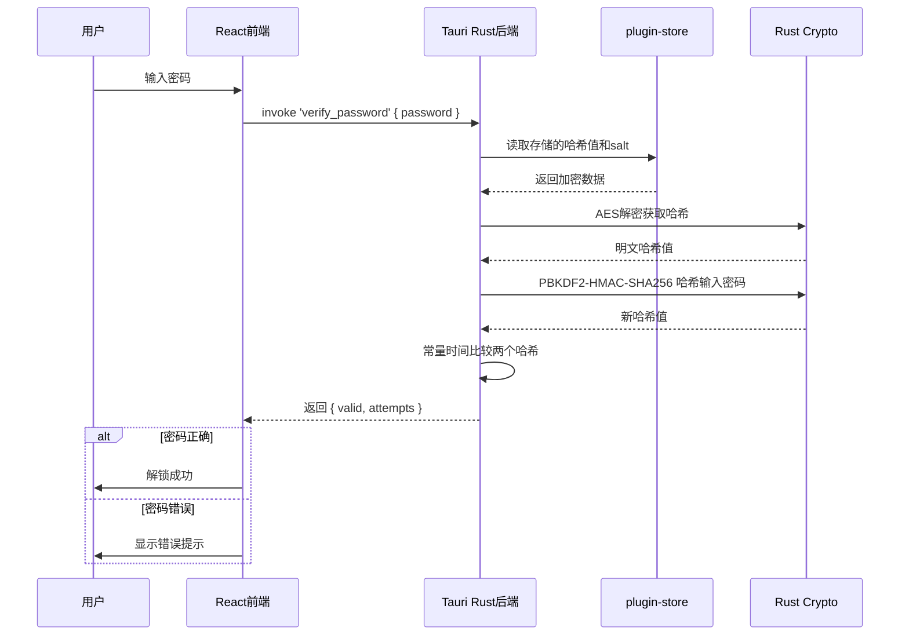

# 电脑屏幕锁定器 - 技术架构文档

## 1. 架构设计

> **轻量级方案**：使用 Tauri v2 框架，后端为 Rust，前端 WebView2（Windows 系统自带 Edge 内核），无需捆绑 Chromium。内存占用约 10-30MB（对比 Electron 的 150-200MB），打包体积约 3-8MB。



## 2. 技术选型

### 2.1 核心技术栈

| 技术领域 | 技术选型 | 版本 | 选型理由 |
|----------|----------|------|----------|
| **桌面框架** | Tauri | ^2.0.0 | Rust后端+系统WebView2，内存仅~10-30MB，打包体积~3-8MB，远优于Electron |
| **后端语言** | Rust | stable | 零成本抽象、内存安全、极高性能，Tauri原生后端 |
| **前端框架** | React | ^18.2.0 | 组件化开发，生态丰富，适合构建交互式UI |
| **构建工具** | Vite | ^5.0.0 | 极速HMR开发体验，Tauri官方Vite插件支持 |
| **样式方案** | Tailwind CSS | ^3.4.0 | 原子化CSS，快速实现现代化暗色主题UI |
| **状态管理** | Zustand | ^4.4.0 | 轻量级状态管理，API简洁直观 |
| **Tauri插件** | tauri-plugin-store | ^2.0.0 | Tauri官方本地JSON持久化存储 |
| **Tauri插件** | tauri-plugin-tray | ^2.0.0 | 系统托盘图标与菜单管理 |
| **动画库** | framer-motion | ^11.0.0 | 声明式动画库，轻松实现交互动画效果 |
| **字体图标** | Lucide React | ^0.300+ | 现代化图标库，风格统一 |

### 2.2 Tauri vs Electron 对比

| 对比项 | Tauri (本方案) | Electron (原方案) |
|--------|---------------|------------------|
| **运行时内核** | Windows 系统 WebView2（共享） | 打包完整 Chromium（独立） |
| **内存占用** | ~10-30 MB | ~150-200 MB |
| **磁盘占用（安装）** | ~3-8 MB | ~150-200 MB |
| **打包体积** | ~3-8 MB | ~80-150 MB |
| **冷启动速度** | < 500ms | ~1-2s |
| **后端语言** | Rust（高性能） | Node.js |
| **系统能力** | 完整（通过Rust调用WinAPI） | 完整（Node.js模块） |
| **前端技术** | 任意Web框架 | 任意Web框架 |

### 2.3 开发环境要求

- **Rust 工具链**：rustup + stable 工具链（Tauri 编译需要）
- **Node.js**：>= 18.x
- **包管理器**：pnpm（优先）/ npm
- **操作系统**：Windows 10 1803+（WebView2 运行时）
- **构建依赖**：Visual Studio C++ Build Tools（Rust 编译 Windows 原生代码需要）

## 3. 项目结构

```
pc-locker/
├── src-tauri/                   # Tauri 后端（Rust）
│   ├── Cargo.toml               # Rust 依赖配置
│   ├── tauri.conf.json          # Tauri 应用配置（窗口、权限等）
│   ├── capabilities/            # Tauri v2 权限声明
│   │   └── default.json
│   ├── src/
│   │   ├── main.rs              # Rust 入口，应用初始化
│   │   ├── lib.rs               # Tauri 命令注册中心
│   │   ├── commands/            # Tauri invoke 命令（前后端通信接口）
│   │   │   ├── mod.rs
│   │   │   ├── password.rs      # 密码验证/设置命令
│   │   │   ├── settings.rs      # 设置读写命令
│   │   │   └── lock.rs          # 锁定/解锁控制命令
│   │   ├── services/
│   │   │   ├── mod.rs
│   │   │   ├── window_manager.rs     # 窗口管理（全屏/置顶/隐藏）
│   │   │   ├── tray_manager.rs       # 系统托盘管理
│   │   │   ├── shortcut_manager.rs   # 全局快捷键注册与拦截
│   │   │   ├── power_monitor.rs      # 电源状态监听
│   │   │   ├── security_guard.rs     # 安全防护（按键拦截等）
│   │   │   └── password_crypto.rs    # 密码加密/解密/验证
│   │   └── utils/
│   │       └── store_helper.rs       # 数据存储辅助工具
│   └── icons/                    # 应用图标
├── src/                         # React 前端代码
│   ├── main.tsx                 # React 入口
│   ├── App.tsx                  # 根组件（场景路由）
│   ├── components/
│   │   ├── LockScreen/          # 锁定界面组件
│   │   │   ├── index.tsx        # 主组件
│   │   │   ├── PasswordInput.tsx # 密码输入框
│   │   │   ├── TimeDisplay.tsx   # 时间日期显示
│   │   │   ├── StatusMessage.tsx # 状态提示消息
│   │   │   └── ParticleBackground.tsx # 粒子背景动画
│   │   └── Settings/            # 设置面板组件
│   │       ├── index.tsx        # 设置面板主组件
│   │       ├── PasswordForm.tsx # 密码修改表单
│   │       └── ConfigOptions.tsx # 配置选项
│   ├── stores/
│   │   └── useStore.ts          # Zustand 全局状态
│   ├── services/
│   │   └── api.ts               # Tauri invoke API 封装
│   ├── hooks/
│   │   ├── usePasswordInput.ts  # 密码输入hook
│   │   └── useIdleTimer.ts      # 空闲检测hook
│   └── styles/
│       └── globals.css          # 全局样式与Tailwind配置
├── package.json
├── vite.config.ts               # Vite 配置
├── tsconfig.json
├── tailwind.config.js
└── index.html
```

## 4. 核心流程与技术实现

### 4.1 Tauri Commands（前后端通信）

Tauri 使用 `invoke`（前端→后端）和 `emit/listen`（事件）替代 Electron 的 IPC：

| Command 名称 | 方向 | 参数类型 | 返回类型 | 说明 |
|-------------|------|---------|----------|------|
| `verify_password` | 前端→Rust | `{ password: string }` | `{ valid: boolean, attempts: number }` | 密码验证 |
| `set_password` | 前端→Rust | `{ new_password: string }` | `{ success: boolean }` | 设置新密码 |
| `get_settings` | 前端→Rust | 无 | `SettingsConfig` | 读取所有设置 |
| `update_settings` | 前端→Rust | `Partial<SettingsConfig>` | `{ success: boolean }` | 更新设置项 |
| `trigger_lock` | 前端→Rust | 无 | 无 | 手动触发锁定 |
| `request_unlock` | 前端→Rust | 无 | 无 | 请求解锁（验证通过后） |
| `check_password_exists` | 前端→Rust | 无 | `{ exists: boolean }` | 检查是否已设密码 |
| `quit_app` | 前端→Rust | 无 | 无 | 退出应用 |

### 4.2 安全机制实现策略

#### 4.2.1 窗口级别防护（tauri.conf.json 配置）

```json
{
  "app": {
    "windows": [{
      "label": "lock",
      "fullscreen": true,
      "always_on_top": true,
      "skip_taskbar": true,
      "resizable": false,
      "decorations": false,
      "transparent": false
    }]
  },
  "security": {
    "csp": "default-src 'self'; script-src 'self'; style-src 'self' 'unsafe-inline'"
  }
}
```

#### 4.2.2 系统级别防护（Rust 后端实现）

- **全局快捷键拦截**：通过 `global-shortcut` Tauri 插件在锁定状态下注册所有逃逸组合键（Alt+Tab、Alt+F4、Win键等），拦截并吞掉按键事件
- **电源事件监听**：使用 Tauri 的 app 生命周期事件监听系统恢复（resume），唤醒时立即展示锁定窗口
- **空闲检测超时**：通过 Rust 调用 Windows API `GetIdleTime()` 定期轮询，超过阈值自动触发锁定
- **窗口焦点保护**：监听窗口 `blur` 事件，失去焦点时立即重新聚焦

### 4.3 密码存储方案（Rust 实现）



**加密流程（Rust 后端）：**
1. 用户设置密码时，使用 `rand` 生成随机 salt（16字节）
2. 使用 `pbkdf2` crate + `sha2` 进行 100000 次迭代哈希（HMAC-SHA256）
3. 使用 `aes-gcm` 对 salt + hash 结果进行 AES-256-GCM 加密
4. 加密数据通过 `tauri-plugin-store` 持久化到本地文件

## 5. 场景定义

采用单窗口场景切换模式：

| 场景标识 | 对应组件 | 触发条件 | 说明 |
|----------|----------|----------|------|
| `lock` | LockScreen | 手动锁定/睡眠唤醒/超时 | 默认显示场景 |
| `setup` | SetupWizard | 首次启动且无密码 | 引导用户设置初始密码 |
| `settings` | SettingsPanel | 托盘菜单点击设置 | 可在解锁状态下打开 |

## 6. 数据模型

### 6.1 配置数据模型 (SettingsConfig)

```typescript
// 前端 TypeScript 类型（与 Rust 结构体对应）
interface SettingsConfig {
  // 密码相关
  password_hash: string;           // AES加密后的密码哈希（base64编码）
  password_salt: string;           // 密码盐值（base64编码）
  is_password_set: boolean;         // 是否已设置密码

  // 行为配置
  auto_lock_timeout: number;        // 自动锁定超时（分钟），0=永不
  lock_shortcut: string;            // 快捷键描述

  // 界面配置
  show_date_time: boolean;          // 是否显示时间日期
  enable_particles: boolean;        // 是否启用粒子背景

  // 安全配置
  max_failed_attempts: number;      // 最大失败次数（默认5）
  lockout_delay_seconds: number;    // 锁定延迟秒数（默认10）
}
```

### 6.2 状态数据模型 (AppState)

```typescript
interface AppState {
  current_scene: 'lock' | 'setup' | 'settings';
  is_locked: boolean;
  failed_attempts: number;
  is_locked_out: boolean;
  lockout_end_time: number | null;
  status_message: string;
  status_type: 'info' | 'error' | 'success';
}
```

## 7. 性能指标

| 指标 | 目标值 | 说明 |
|------|--------|------|
| **内存占用** | < 40MB RSS | 含WebView2渲染进程，远低于Electron |
| **CPU占用（空闲）** | < 0.5% | 后台待命状态 |
| **CPU占用（锁屏动画）** | < 3% | 粒子动画运行时 |
| **冷启动时间** | < 500ms | 从触发锁定到界面完全显示 |
| **解锁响应时间** | < 50ms | 密码验证到窗口关闭 |
| **安装包大小** | < 10MB | NSIS 安装包 |

## 8. 兼容性要求

- **操作系统**：Windows 10 1803+（64位，含 WebView2 运行时）
- **架构**：x64
- **DPI 支持**：96 / 125% / 150% / 200%
- **WebView2**：Windows 10 1803+ 自带（如无会自动引导安装）
